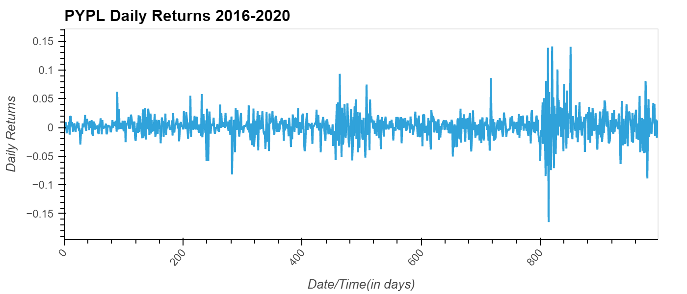

# **Challenge 7 -ETF Analyzer**
---
## *Necessary Libraries*
- import numpy as np
- import pandas as pd
- import hvplot.pandas
- import sqlalchemy

## *Analysis*

From the SQL database the data for 'GDOT', 'GS', 'PYPL', 'SQ' needed to be collected and put into a dataframe through a query. First, Analysis had to do with the PYPL database and creating a graph of the table returns, which looks as follows:




Afterwards, using the date and and the daily returns, the cumulative returns were calculated using the following code
```python 
#dataframe for the time, daily_returns
pypl_daily_returns = pypl_dataframe[['time','daily_returns']]
# cumulative returns
pypl_cumulative_rtrns = (pypl_daily_returns['daily_returns']+1).cumprod()
pypl_cumulative_rtrns
```
Further analysis on the PYPL was to collect the closing price that is greater than 200 and the top 10 daily returns. Those were collected by the following code:
```python
# create a PYPL query to select closing prices greater than 200
query = """
SELECT time, close
FROM PYPL
WHERE close > 200.00
"""
# Using the query, read the data from the database into a Pandas DataFrame
pypl_higher_than_200 = pd.read_sql_query(query, engine)
```
and 
```python 
# create a PYPL query to select the top 10 daily returns
query = """
SELECT time, daily_returns
FROM PYPL
ORDER BY daily_returns DESC
LIMIT 10
"""
# Using the query, read the data from the database into a Pandas DataFrame
pypl_top_10_returns = pd.read_sql_query(query, engine)
```

The last part of the analysis was to collect the daily returns for all of the data in the database (GDOT, GS, PYPL and SQ) and calculating the cumulative returns for them. This was done by creating a query and connecting the data by ```INNER JOIN``` of the date (```time``` columns in the database).

The graph for the cumulative returns for all the data in the database lookes like the below:


As the analysis was done in a Jupyter Notebook, the data can be presented in a webpage via Voila and would look similar to the below:


